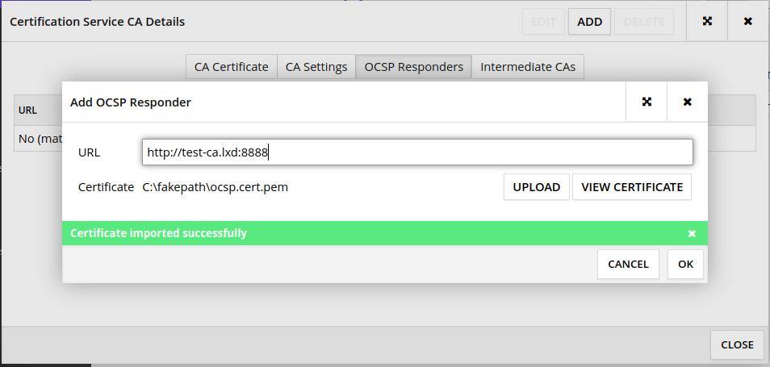

|  |
| -------------------------: |

# X-Road: Preparing Ubuntu OS for installing X-Road plus tips
Version: 1.0

---

## License

Install:
* git
```
sudo apt update
sudo apt istall git
```
 * [Sdkman](https://sdkman.io/install)
```
sudo apt install curl
curl -s "https://get.sdkman.io" | bash
source "$HOME/.sdkman/bin/sdkman-init.sh"
```
 * [docker](https://www.digitalocean.com/community/tutorials/how-to-install-and-use-docker-on-ubuntu-20-04)
```
sudo apt update
sudo apt install apt-transport-https ca-certificates curl software-properties-common
curl -fsSL https://download.docker.com/linux/ubuntu/gpg | sudo apt-key add -
sudo add-apt-repository "deb [arch=amd64] https://download.docker.com/linux/ubuntu focal stable"
sudo apt update
apt-cache policy docker-ce
sudo apt install docker-ce
sudo systemctl status docker
```
* [docker compose](https://www.digitalocean.com/community/tutorials/how-to-install-and-use-docker-compose-on-ubuntu-20-04)
```
sudo curl -L "https://github.com/docker/compose/releases/download/1.27.4/docker-compose-$(uname -s)-$(uname -m)" -o /usr/local/bin/docker-compose
sudo chmod +x /usr/local/bin/docker-compose
docker-compose --version
```

Postgres client
```
sudo apt install postgresql-client-common
sudo apt install postgresql-client -y
```
Install Security server
```
sudo apt istall xroad-securityserver-ee
```

* [ansible](https://www.digitalocean.com/community/tutorials/how-to-install-and-configure-ansible-on-ubuntu-18-04)
```
sudo apt-add-repository ppa:ansible/ansible
sudo apt update
sudo apt install ansible
```
* [ansible](https://ubuntu.com/blog/installing-lxd-and-the-command-line-tool)
```
sudo add-apt-repository ppa:ubuntu-lxc/lxd-stable
sudo apt update
sudo apt dist-upgrade
sudo apt install lxd

sudo lxd init

```
almost all should be default [except](https://jointxroad.slack.com/archives/CA66FG50T/p1596442813025000?thread_ts=1596437339.021700&cid=CA66FG50T)

```Would you like LXD to be available over the network? (yes/no) [default=no]```

This document is licensed under the MIT


[more info](https://youtu.be/JiTAFRPDUeQ?t=1413)

[Configuration anchors for X-tee](https://x-tee.ee/anchors/)